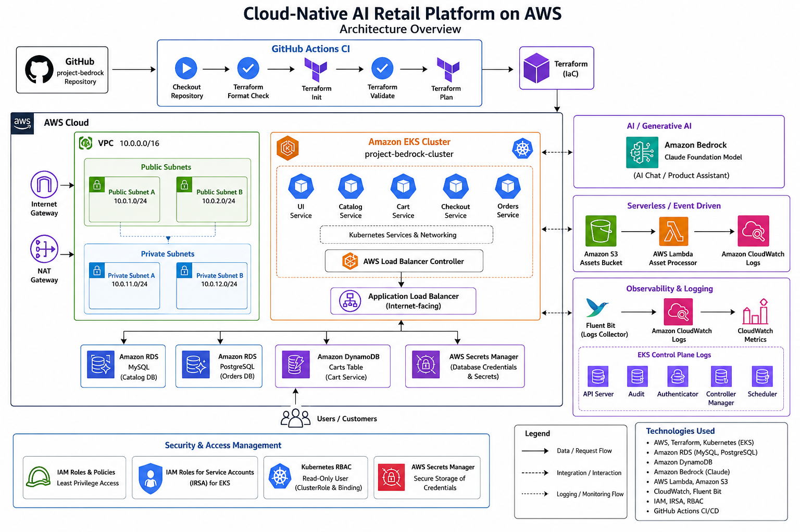

# Cloud-Native AI Retail Platform on AWS

## Project Overview

This project implements a production-style cloud-native retail application on AWS using Infrastructure as Code (Terraform), Kubernetes (Amazon EKS), serverless event-driven services, AI integration with Amazon Bedrock, observability, and CI/CD automation.

The solution demonstrates modern cloud engineering practices including:

* Infrastructure as Code (Terraform)
* Kubernetes Orchestration (Amazon EKS)
* Microservices Architecture
* Serverless Computing
* AI Integration with Amazon Bedrock
* Observability & Monitoring
* Secure Secrets Management
* CI/CD with GitHub Actions

---

## Architecture Diagram

Place the architecture image inside a `docs/` folder and reference it as shown below:

```markdown

```

---

# Architecture Overview

The platform consists of multiple AWS services working together to provide a scalable, resilient, and observable retail application.

## Networking

* Custom VPC (10.0.0.0/16)
* Public Subnets
* Private Subnets
* Internet Gateway
* NAT Gateway
* Security Groups

---

## Kubernetes Layer

### Amazon EKS Cluster

**Cluster Name**

```text
project-bedrock-cluster
```

### Microservices Deployed

| Service  | Description              |
| -------- | ------------------------ |
| UI       | Frontend Application     |
| Catalog  | Product Catalog Service  |
| Cart     | Shopping Cart Service    |
| Checkout | Checkout Service         |
| Orders   | Order Processing Service |

---

## Databases

| Service | Database              |
| ------- | --------------------- |
| Catalog | Amazon RDS MySQL      |
| Orders  | Amazon RDS PostgreSQL |
| Cart    | Amazon DynamoDB       |

---

## Secrets Management

Amazon Secrets Manager securely stores:

* MySQL Password
* PostgreSQL Password

No credentials are hardcoded into Terraform or application code.

---

## AI Layer

Amazon Bedrock provides:

* Foundation Model Access
* Conversational AI Features
* Product Recommendation Capabilities

---

## Serverless Layer

### Event-Driven Image Processing

```text
S3 Upload
     ↓
Lambda Function
     ↓
CloudWatch Logs
```

Components:

* Amazon S3 Assets Bucket
* AWS Lambda Function
* Event Notifications
* CloudWatch Logging

---

## Observability Layer

Implemented using:

* Amazon CloudWatch
* CloudWatch Container Insights
* Fluent Bit
* EKS Control Plane Logging

Telemetry collected:

* Application Logs
* Kubernetes Logs
* Node Metrics
* EKS Control Plane Logs

---

# Technology Stack

## Cloud Platform

* AWS

## Infrastructure as Code

* Terraform

## Container Orchestration

* Kubernetes
* Amazon EKS

## Databases

* Amazon RDS MySQL
* Amazon RDS PostgreSQL
* Amazon DynamoDB

## AI Services

* Amazon Bedrock
* Claude Foundation Models

## Serverless Services

* AWS Lambda
* Amazon S3

## Monitoring

* Amazon CloudWatch
* Fluent Bit

## CI/CD

* GitHub Actions

---

# Infrastructure Components

## VPC Configuration

### CIDR Block

```text
10.0.0.0/16
```

### Public Subnets

```text
10.0.1.0/24
10.0.2.0/24
```

### Private Subnets

```text
10.0.11.0/24
10.0.12.0/24
```

### Availability Zones

```text
us-east-1a
us-east-1b
```

---

## Amazon EKS

### Cluster

```text
project-bedrock-cluster
```

### Kubernetes Version

```text
1.34
```

### Worker Nodes

```text
Managed Node Group
```

### Instance Type

```text
t3.small
```

---

## Terraform Modules

```text
modules/
├── vpc
├── eks
├── rds-mysql
├── rds-postgres
├── dynamodb
├── secrets-manager
└── serverless
```

---

# Remote State Management

Terraform state is stored remotely in Amazon S3.

```hcl
terraform {
  backend "s3" {
    bucket = "bedrock-terraform-state-alt-soe-025-3672"
    key    = "global/s3/terraform.tfstate"
    region = "us-east-1"
  }
}
```

Features:

* Remote State Storage
* State Versioning
* Team Collaboration Ready

---

# Deployment

## Clone Repository

```bash
git clone https://github.com/Decypher1/project-bedrock.git

cd project-bedrock/terraform
```

---

## Initialize Terraform

```bash
terraform init
```

---

## Validate Configuration

```bash
terraform validate
```

---

## Generate Execution Plan

```bash
terraform plan
```

---

## Deploy Infrastructure

```bash
terraform apply
```

---

# Verification

## Verify EKS Cluster

```bash
kubectl get nodes
```

---

## Verify Application Pods

```bash
kubectl get pods -n retail-app
```

---

## Verify Services

```bash
kubectl get svc -n retail-app
```

---

## Verify Databases

```bash
aws rds describe-db-instances
```

---

# Serverless Testing

Create a test file:

```bash
echo "test" > test-image.txt
```

Upload to S3:

```bash
aws s3 cp test-image.txt s3://bedrock-assets-alt-soe-025-3672/
```

Verify Lambda execution:

```bash
aws logs filter-log-events \
--log-group-name "/aws/lambda/bedrock-asset-processor"
```

Expected output:

```text
Image received: test-image.txt
```

---

# Observability Verification

## EKS Control Plane Logs

```bash
aws logs describe-log-groups
```

Expected:

```text
/aws/eks/project-bedrock-cluster/cluster
```

---

## Container Insights

Expected Log Groups:

```text
/aws/containerinsights/project-bedrock-cluster/application

/aws/containerinsights/project-bedrock-cluster/host

/aws/containerinsights/project-bedrock-cluster/dataplane
```

---

# CI/CD Pipeline

GitHub Actions automatically executes:

```text
Push to GitHub
        ↓
Terraform Format Check
        ↓
Terraform Init
        ↓
Terraform Validate
        ↓
Terraform Plan
```

Workflow Location:

```text
.github/workflows/terraform.yml
```

Pipeline Status:

```text
SUCCESSFUL
```

---

# Security Controls

The following security measures have been implemented:

* IAM Least Privilege Access
* Kubernetes RBAC
* Secrets Manager Integration
* Private Subnet Deployment
* Security Groups
* IAM Roles for Service Accounts (IRSA)
* Secure Remote State Storage

---

# Project Structure

```text
project-bedrock/
│
├── .github/
│   └── workflows/
│       └── terraform.yml
│
├── terraform/
│   ├── backend/
│   ├── observability/
│   ├── modules/
│   │   ├── vpc/
│   │   ├── eks/
│   │   ├── rds-mysql/
│   │   ├── rds-postgres/
│   │   ├── dynamodb/
│   │   ├── secrets-manager/
│   │   └── serverless/
│   │
│   ├── main.tf
│   ├── variables.tf
│   ├── outputs.tf
│   ├── provider.tf
│   └── backend.tf
│
└── README.md
```

---

# Future Improvements

* Automated Terraform Apply Pipeline
* GitOps Deployment with ArgoCD
* Prometheus and Grafana Integration
* Multi-Environment Support (Dev, Staging, Production)
* Blue/Green Deployments
* Cost Optimization Dashboard

---

# Author

**Martins Umekwe**

Cloud Engineer

**Student ID**

```text
ALT-SOE-025-3672
```

**Capstone Project**

```text
Cloud-Native AI Retail Platform on AWS
```

### Technologies

```text
AWS | Terraform | Kubernetes | EKS | RDS | DynamoDB | Lambda | Bedrock | CloudWatch | GitHub Actions
```
